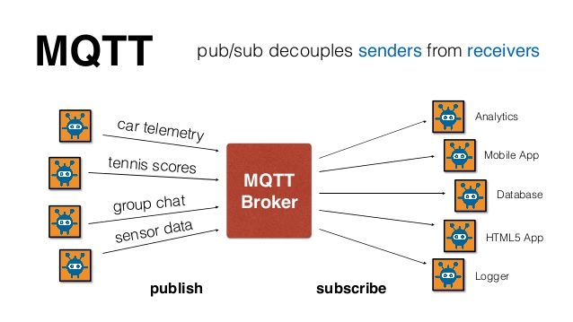

# IIOT工业物联网数据可视化开源系统

# 1.关于本系统

本系统采用开源的技术栈，主要包括以下功能的实现：

- [x]  传感器
- [x]  工业数据采集节点
- [x]  设备端MQTT客户端搭建
- [x]  MQTT Broker服务器搭建
- [x]  MQTT 监控服务器搭建
- [x]  TSDB 数据库搭建
- [x]  MQTT 监控服务器
- [x]  Grafana Web可视化服务器
- [x]  Docker Compose服务编排
- [x]  Docker镜像制作

# 2.系统架构


服务器：

- MQTT 服务器：EMQX
- InfluxDB 服务器：开源时间序列数据库
- Grafana 服务器：开源时间序列分析工具
- MQTT 监控服务器： MQTT Monitor

数据采集节点：

- Node 1: 开源树莓派数据采集节点
- Node 2: 开源树莓派数据采集节点

技术栈：

- Dokcer&Docker Compose
- Python
- 传感器以及模拟数据数据采集知识（ADC、采样率、工程值计算）
- MQTT 协议
- TCP、HTTP协议
- TSDB时间序列数据库
- 数据可视化
- web可视化
- 服务器技术

## 2.1 Docker & Docker Compose

本系统的所有服务器基于DockeFile 生成镜像，并使用Compose 完成服务之间的任务编排。

### Docker

   Docker的英文翻译是“搬运工”的意思，搬运的东西就是我们常说的集装箱Container，Container 里面装的是任意类型的 App，开发人员可以通过 Docker 将App 变成一种标准化的、可移植的、自管理的组件，我们可以在任何主流的操作系统中开发、调试和运行。


### Docker Compose

   Docker Compose是Docker官方编排（Orchestration）项目之一，负责快速的部署分布式应用。其代码目前在https://github.com/docker/compose上开源。Compose 定位是 「定义和运行多个 Docker 容器的应用（Defining and running multi-container Docker applications）」，其前身是开源项目Fig.

 Docker Compose 的两个重要概念：

- 服务 (service)：一个应用的容器，实际上可以包括若干运行相同镜像的容器实例。
- 项目 (project)：由一组关联的应用容器组成的一个完整业务单元，在 docker-compose.yml 文件中定义。

## 2.2 Raspberry PI

   Revolution Pi是一款开源、模块化和低成本的工业电脑基于流行的树莓派(Raspberry Pi)。操作系统采用的是定制的Raspbian版本，其包括一个实时内核补丁。这样能够尽可能地接近树莓派的原始开发环境并且还能获得高水平的控制，涵盖调度表管理的任务优先权。调度表，其通过操作系统控制任务的执行，和这个修改的内核一起被扩展配置，因此通常由网络和其它I/O访问造成的延迟被有效避免。用于扩展模块的相应的驱动也已经被预装。

对于所有那些需要性能和存储的丰富，RevPi Core 3+带快速树莓派计算模块3+是准确的选择。Broadcom的4核处理器具有足够的计算功率来处理甚复杂的任务。

数据采集节点使用了一个树莓派计算模块，同一个模拟I/O模，RevPi AIO具有一个28-pin I/O连接器在前端。通过使用RevPi AIO，Revolution Pi系统可扩展到4路模拟输入、2路模拟输出和2路RTD通道。数据采集节点如下所示。


## 2.3 InfluxDB

Influxdb是一个开源的分布式时序、时间和指标数据库，使用go语言编写，无需外部依赖。

三大特性：

- 时序性（Time Series）：与时间相关的函数的灵活使用（诸如最大、最小、求和等）；
- 度量（Metrics）：对实时大量数据进行计算；
- 事件（Event）：支持任意的事件数据，换句话说，任意事件的数据我们都可以做操作。

同时，有以下几大特性：

- schemaless(无结构)，可以是任意数量的列；
- min, max, sum, count, mean, median 一系列函数，方便统计；
- Native HTTP API, 内置http支持，使用http读写
- Powerful Query Language
- Built-in Explorer 自带管理工具。

## 2.4 MQTT Broker

MQTT  是IBM开发的一个即时通讯协议，目前已经是物联网的重要组成部分，MQTT支持所有的平台，主要作为物联网设备消息传输的通讯协议。目前有很多的公有云平台都已经支持MQTT协议，包括阿里的LMQ、腾讯的IOT-MQ、百度天工智能物联网等。

本开源系统基于EMQX来搭建的，EMQ特点如下：

- 完全开发源代码，基于 Apache Version 2.0 开源协议，开源项目： [https://github.com/emqx/emqx](https://github.com/emqx/emqx)；
- 分布式集群架构多个 EMQ X Broker 节点可以作为集群一起工作，提供更高的性能和可用性；
- 完整支持 MQTT V3.1.1/V5.0 协议规范，完整支持 TCP、TLS、WebSocket 连接；
- 高并发低延迟，单集群百万并发 MQTT/TCP 连接支持，基于 Erlang/OTP 电信级软实时消息架构；
- 扩展模块与插件，LDAP, MySQL, Redis, MongoDB 等扩展插件集成，支持插件模式扩展服务器功能；
- 跨平台或云部署，支持跨 Linux、Windows、macOS 平台安装，支持公有云、私有云、K8S/容器部署；

EMQX 优点：

优点是功能全面，文档齐全，社区活跃，有很好的支持；

EMQ 缺点:

缺点是因为erlang语言，对于其他语言的开发者自己扩展有一定难度；

MQTT 的通信是通过发布/订阅的方式来实现的，消息的发布方和订阅方通过这种方式来进行解耦，它们没有直接地连接，它们需要一个中间方。在 MQTT 里面我们称之为 Broker，用来进行消息的存储和转发。一次典型的 MQTT 消息通信流程如下所示：



本开源系统工业数据的流向：

1. 数据采集节点作为发布方，发送方将采集的数据消息发送到 Broker；
2. Broker 接收到消息以后，检查已经订的订阅方，然后将消息推送到这些订阅方；
3. 订阅方从 Broker 获取该消息，MQTT Monitor 作为订阅方，实时将更新的数据发送至TSDB 时序数据库中；

## 2.5 Grafana

Grafana是一个跨平台的开源的度量分析和可视化工具，可以通过将采集的数据查询然后可视化的展示，并及时通，在该系统中用来实时拉取TSDB中的数据，它主要有以下六大特点：

- 展示方式：快速灵活的客户端图表，面板插件有许多不同方式的可视化指标和日志，官方库中具有丰富的仪表盘插件，比如热图、折线图、图表等多种展示方式；
- 数据源：Graphite，InfluxDB，OpenTSDB，Prometheus，Elasticsearch，CloudWatch和KairosDB等；
- 通知提醒：以可视方式定义最重要指标的警报规则，Grafana将不断计算并发送通知，在数据达到阈值时通过Slack、PagerDuty等获得通知；
- 混合展示：在同一图表中混合使用不同的数据源，可以基于每个查询指定数据源，甚至自定义数据源；
- 注释：使用来自不同数据源的丰富事件注释图表，将鼠标悬停在事件上会显示完整的事件元数据和标记；
- 过滤器：Ad-hoc过滤器允许动态创建新的键/值过滤器，这些过滤器会自动应用于使用该数据源的所有查询。

## 2.6 MQTT  Monitor

          MQTT Monitor作为订阅MQTT Broker的全部数据，将更新的数据实时的更新至TSDB数据库中，并将数据数据实时推送至WEB端。

# 3 搭建系统

## 3.1 服务器端


``` docker
version: '2'

services:
    mqtt-monitor:
        container_name: mqtt-monitor
        build: ./MQTTMonitor
        network_mode: "host"     
        ports:
            - 8080:8080
        
        depends_on:
            - mqtt-broker 
    mqtt-broker:
        image: emqx/emqx
        container_name: mqtt-broker
       
        ports:
            - 1883:1883
            - 8083:8083
            - 8084:8084
            - 18083:18083

    grafana:
        image: grafana/grafana
        container_name: grafana
        network_mode: "host"
        ports:
            - 3000:3000

```

## 3.2 云部署
1. 登陆云主机 ，系统为centos7.6 64bits,4G内存；

2. 安装 docker-ce
```docker
yum update

sudo yum install -y yum-utils device-mapper-persistent-data lvm2


sudo yum-config-manager --add-repo http://mirrors.aliyun.com/docker-ce/linux/centos/docker-ce.repo


sudo yum makecache fast

sudo yum install docker-ce
```
3. 安装docker-compose
采用 pip 方式安装，Docker-compose，首先确保安装python3版本的环境，并将pip 设置成aliyun 镜像。
设置pip国内镜像，想要操作以下步骤：
```
cd /root/
mkdir .pip
cd .pip
touch pip.conf
```
将 pip.conf 包含以下信息。
```
[global]
index-url=http://mirrors.aliyun.com/pypi/simple/
trusted-host=mirrors.aliyun.com
```

index-url=http://mirrors.aliyun.com/pypi/simple/，是指定阿里云源；

trusted-host=mirrors.aliyun.com，是信任阿里云站点

```
yum -y install -y epel-release	#安装pip需要先安装epel-release包

yum install -y python-pip	#安装pip

pip install --upgrade pip	#升级pip

pip install docker-compose #安装docker-compose

docker-compose -v	#查看docker-compose的版本
```
4.测试运行环境
5.从github 上clone项目到本地；
6.
